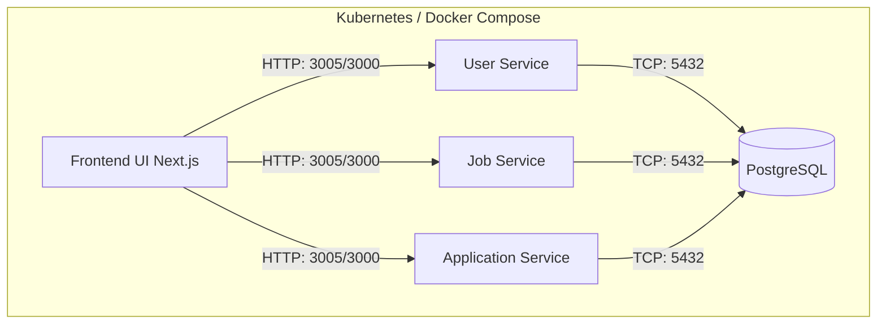

# Cloud Job Portal System

A modern, scalable, microservices-based job portal application designed to connect job seekers with employers. Built with a robust technology stack including NestJS, Next.js, and PostgreSQL, and fully orchestrated using Docker Compose and Kubernetes.

---

## 📋 Project Overview

The Cloud Job Portal is a comprehensive platform built to handle the complexities of modern recruitment. It is designed around a microservices architecture, ensuring high availability, fault tolerance, and independent scalability for different domains of the application. 

Key features include:
- User registration, authentication, and profile management.
- Creation, retrieval, and management of job postings.
- Submission and tracking of job applications.
- A dynamic, responsive frontend UI to seamlessly interact with the backend services.

## 🏗️ Architecture

The project follows a cloud-native microservices architecture pattern, heavily leveraging container orchestration.



## 🛠️ Technologies Used

### Frontend
- **Framework**: Next.js (App Router)
- **Styling**: Tailwind CSS / Vanilla CSS (Glassmorphism design)
- **Language**: TypeScript

### Backend (Microservices)
- **Runtime**: Node.js
- **Framework**: NestJS 11.x
- **Language**: TypeScript
- **Authentication**: JWT (Passport.js)
- **ORM**: TypeORM

### Infrastructure & Operations
- **Database**: PostgreSQL 15
- **Containerization**: Docker & Docker Compose
- **Orchestration**: Kubernetes (Deployments, Services, StatefulSets)

---

## ⚙️ Services Overview & Port Mappings

The system consists of the following independent services:

| Service Name | Description | Internal Port | Exposed Port (Compose) |
|---|---|---|---|
| **Frontend** | Next.js UI providing the user interface | 3000 | 3005 |
| **User Service** | Handles user authentication and profile management | 3000 | 3001 |
| **Job Service** | Manages job postings, descriptions, and employer interactions | 3000 | 3002 |
| **Application Service** | Handles job applications submitted by users | 3000 | 3003 |
| **PostgreSQL** | Primary relational database for all services | 5432 | 5432 |

---

## 🚀 Deployment Instructions

### 🐳 Docker Compose Setup (Local Development)

Docker Compose is the easiest way to spin up the entire application stack locally.

1. **Clone the repository**:
   ```bash
   git clone <repository-url>
   cd Cloud-Job-Portal
   ```

2. **Build and start all services**:
   ```bash
   docker-compose up -d --build
   ```
   *This command builds the Docker images (including the standalone Next.js frontend) and starts all microservices alongside the PostgreSQL database.*

3. **Access the application**:
   - Open your browser and navigate to: **http://localhost:3005**

4. **View logs or stop the environment**:
   ```bash
   # View logs
   docker-compose logs -f
   
   # Stop all services
   docker-compose down
   ```

### ☸️ Kubernetes Setup (Production/Staging)

For a production-ready orchestration, the application includes complete Kubernetes manifests located in the `/k8s` directory.

1. **Start your local Kubernetes cluster** (e.g., Minikube, Docker Desktop).

2. **Create the Namespace**:
   ```bash
   kubectl apply -f k8s/namespace.yaml
   ```

3. **Deploy the Database**:
   ```bash
   kubectl apply -f k8s/postgres/
   ```

4. **Deploy Backend Microservices**:
   ```bash
   kubectl apply -f k8s/user-service/
   kubectl apply -f k8s/job-service/
   kubectl apply -f k8s/application-service/
   ```

5. **Deploy the Frontend**:
   ```bash
   kubectl apply -f k8s/frontend/
   ```

6. **Verify the Deployment**:
   ```bash
   kubectl get all -n job-portal
   ```

7. **Access the Application**:
   Since the services use `ClusterIP`, you can access the frontend using port-forwarding:
   ```bash
   kubectl port-forward service/frontend 3005:3000 -n job-portal
   ```
   Navigate to **http://localhost:3005** in your browser.

---

## 📸 Screenshots

*(Replace the placeholders below with actual screenshots of your application)*

### Home Page
`[Add Screenshot Here: e.g., ]`

### Job Listings
`[Add Screenshot Here: e.g., ]`

### User Profile
`[Add Screenshot Here: e.g., ]`

---

## 📝 License
This project is proprietary and currently UNLICENSED.
